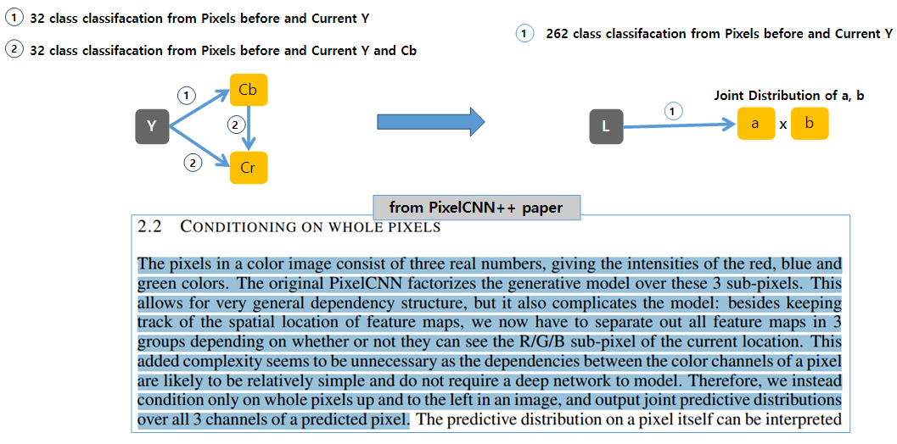
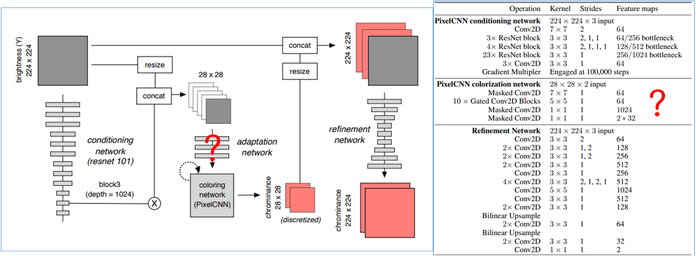
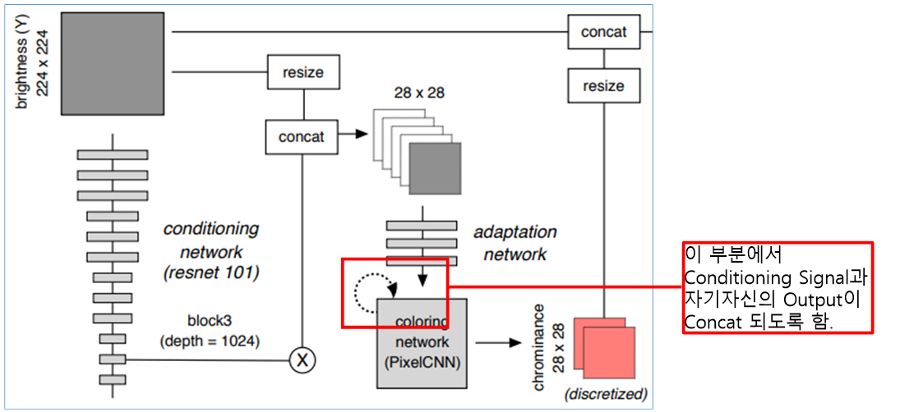
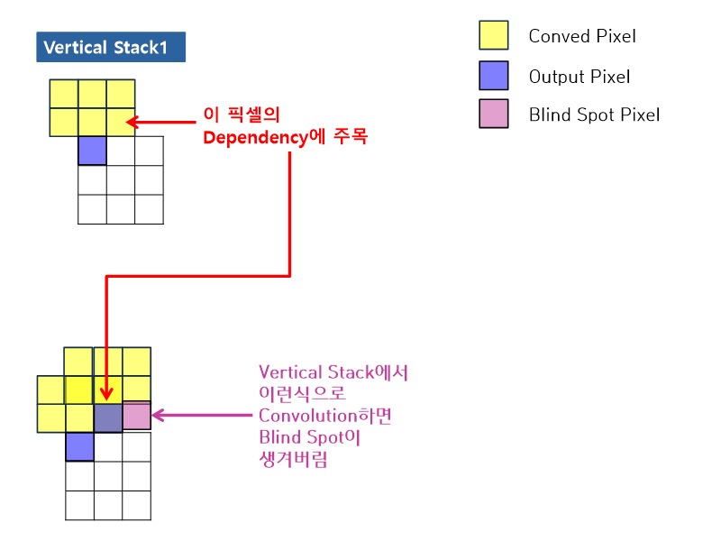
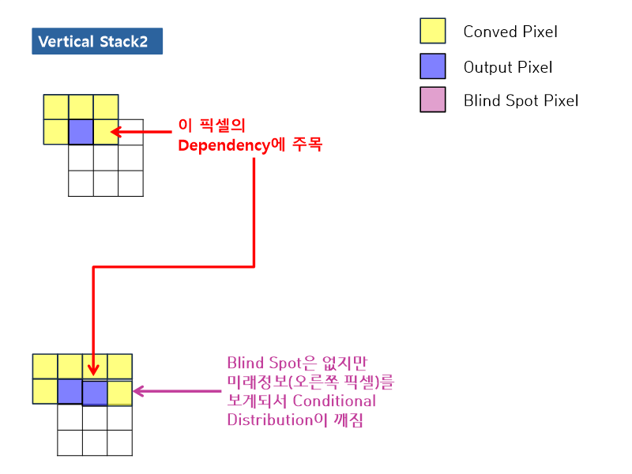
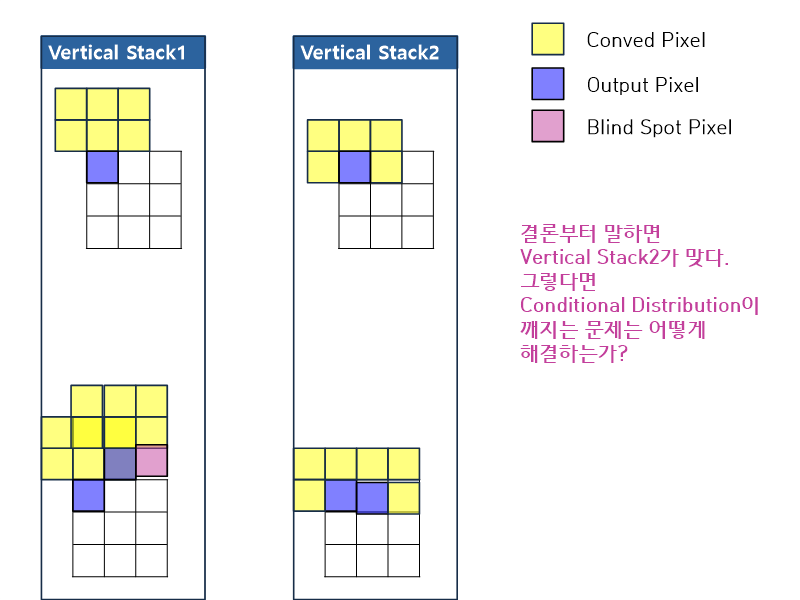
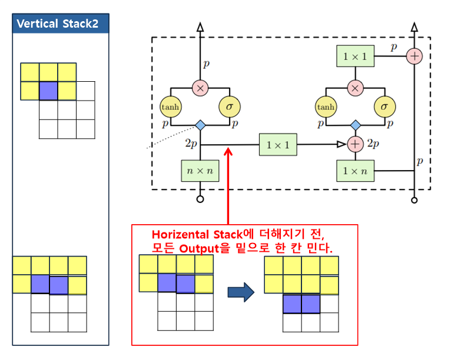
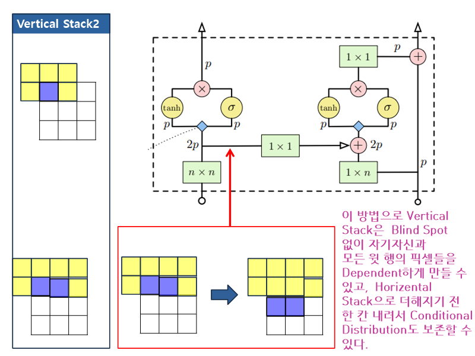
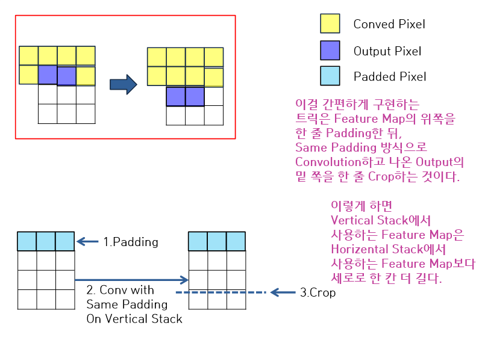

# 1.Overview
구현과정에서의 특징과 원본 논문과의 차이점을 기술한다.

# 2.Detail

## 2.1.Color Space

Color Space로, YCbCr대신 사람의 시각인지에 가장 가까운 Lab Color Space를 사용했다.

## 2.2.Distribution 

PixelCNN++에 따르면, 영상에서 채널간의 Dependency가 그렇게 복잡하지 않으므로, a, b 두 채널을 각각 Sequential하게 예측하는 대신, Joint Distribution을 한꺼번에 예측하도록 했다. a, b의 순서쌍은 총 262개로 Quantization했다.

## 2.3.Architecture

신경망의 구조에 대해서, 논문에 정확히 서술되어 있지 않거나 애매하게 설명된 부분들이 있다. Adaptation Network의 구조가 설명되어 있지 않고, Pixel CNN Colorization Network의 Input이 28 x 28 x 2인 것도 이상하다.  Conditioning Feature Map과 자신의 Output을 Recursive하게 받을려면 채널이 2보다 커야 하기 때문이다.

그런데 저자가 메일도 안 받고 제대로 된 공개구현체도 없어서 애매한 부분들은 그냥 직접 설계하기로 했다. 다만 직접 설계하되, 최대한 논문에 나와있는 단서들과 설계철학을 반영하여 설계했다.

먼저 Adqptation Network는 간단하게 3x3 Convolution Layer 3개를 쌓아서 구성했다. Output의 차원은 28 x 28 x 64이고, 이것이 PixelCNN의 Output에서 샘플링한 28 x 28 x 2의 데이터와 Concat되어, 28 x 28 x 66의 데이터가 되어 PixelCNN의 Input으로 들어간다.

내가 재설계한 Architecture를 표로 나타내면 다음과 같다.

# 3.Supplementary Explanation

이 구조에 쓰인 PixelCNN과 Gated PixelCNN 구조를 이용할려면, [Pixel Recurrent Neural Networks](https://arxiv.org/abs/1601.06759), [Conditional Image Generation with PixelCNN Decoders](https://papers.nips.cc/paper/6527-conditional-image-generation-with-pixelcnn-decoders.pdf) 이 두 논문을 이해해야 하는데, 둘 다 같은 저자가 썼는데 아이디어는 좋은데 설명을 정말 역겨울 정도로 못 해놨다. 제 3자의 도움없이 논문만 보고 이 두 구조를 이해한다는 것은 불가능에 가깝다고 생각한다.

그래서 이 논문을 이해하기 위해 구글링을 정말 많이 했는데, 이 [페이지](http://sergeiturukin.com/2017/02/24/gated-pixelcnn.html)에서 정말 많은 도움을 받았다. 그림과 애니메이션을 통해 Vertical Stack과 Horizental Stack의 개념을 잘 설명하고 있으니 참고하면 이 무책임하게 쓰여진 시리즈를 이해하는데 많은 도움이 될 것이다.

또한 내가 이해하기 편하게 별도로 그림으로 그려 정리해보았다.

